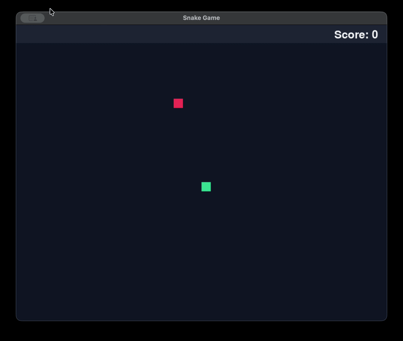

# Snake Game

A classic Snake Game built with Python and Pygame.

## Demo


## Features

- **Classic Gameplay**: Eat food to grow your snake and increase your score.
- **Grid-based Movement**: The snake moves in discrete block steps for precise control.
- **Scoreboard**: Real-time score tracking displayed at the top.
- **Game Over Menu**: Interactive game over screen with "New Game" and "Quit" options.
- **Input Methods**: Supports keyboard for gameplay, and both keyboard and mouse for menu navigation.

## Controls

### Gameplay
- **Up Arrow**: Move Up
- **Down Arrow**: Move Down
- **Left Arrow**: Move Left
- **Right Arrow**: Move Right
- **ESC**: Quit the game

### Game Over Menu
- **Up/Down Arrows**: Navigate options
- **Enter**: Select option
- **Mouse**: Hover and click to select options

## Setup

Create a virtual environment:
```bash
python3 -m venv venv
source venv/bin/activate
```

Install the project with development dependencies:
```bash
pip install -e ".[dev]"
```

## Running the application

Run the installed command:
```bash
snake-game
```
Or run the entrypoint directly:
```bash
python -m snake_game.main
```

## Running tests

```bash
pytest
```
